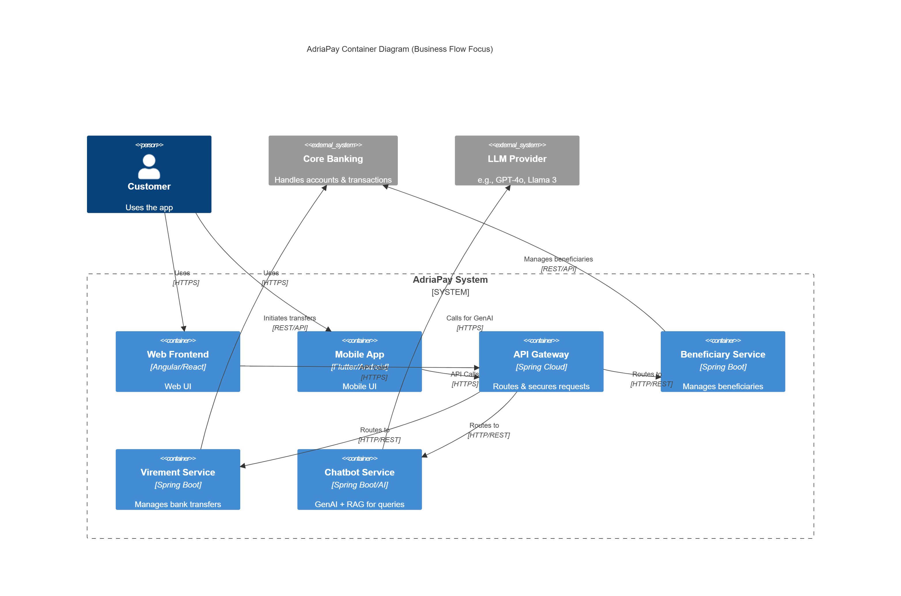
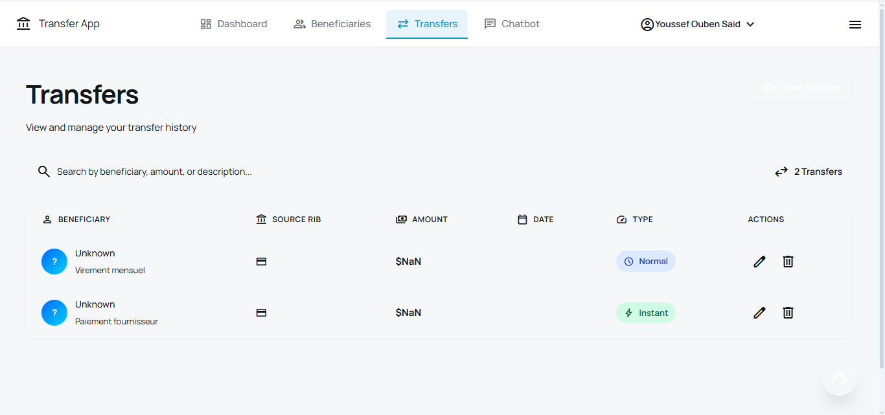
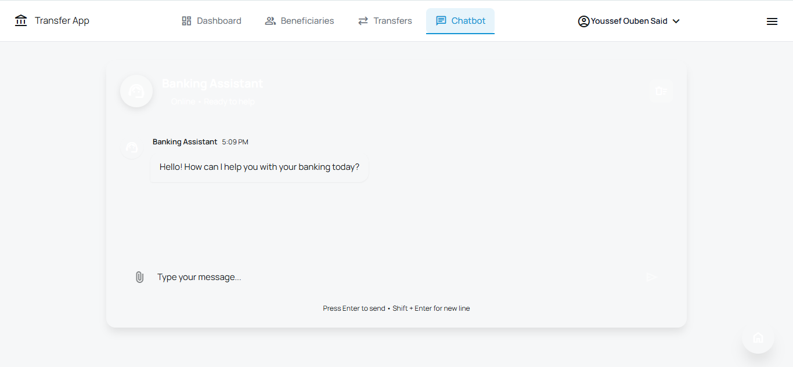

# AdriaPay: Microservices-based Banking Application

<div align="center">
  
  <p><em>Modern Banking Transfers Made Simple</em></p>
</div>

## 📋 Table of Contents

- [Overview](#overview)
- [Problem Statement](#problem-statement)
- [Architecture](#architecture)
    - [Container Diagram](#container-diagram-business-flow)
    - [Service Breakdown](#service-breakdown)
- [Features](#features)
- [Screenshots](#screenshots)
- [Technology Stack](#technology-stack)
- [Development Roadmap](#development-roadmap)
- [Getting Started](#getting-started)
- [Documentation](#documentation)
- [Contributing](#contributing)
- [License](#license)

---

## 🎯 Overview

AdriaPay is a Proof of Concept (POC) web and mobile banking application designed to streamline bank transfer management for clients. Built with a modern microservices architecture leveraging the Spring Boot and Spring Cloud ecosystem, AdriaPay provides:

- **Beneficiary Management**: Organize and manage transfer recipients
- **Secure Transfers**: Process normal and instant bank transfers
- **AI-Powered Support**: Integrated chatbot for intelligent user assistance
- **Multi-Platform**: Web (Angular/React) and Mobile (Flutter/Android) clients

---

## 🎯 Problem Statement

Financial institutions need a scalable, maintainable solution for managing banking transfers. AdriaPay addresses this by providing:

- A microservices-based architecture for better scalability and maintainability
- Secure beneficiary and transfer management
- Real-time transaction processing
- Intelligent customer support through AI-powered chatbot
- Multi-channel access (web and mobile)

---

## 🏗️ Architecture

The system employs a microservices architecture, designed and visualized using the C4 model. The architecture separates concerns into functional and technical microservices, ensuring scalability, maintainability, and resilience.

> **Note:** The diagram focuses on the main business flow for clarity. All services communicate with the Discovery Service and Config Service, which are omitted from the diagram to reduce visual complexity.

### Container Diagram (Business Flow)



### Service Breakdown

#### 🎯 Functional Microservices

**1. Bénéficiaire-service (Beneficiary Service)**
- Manages beneficiary information and operations
- **Data Model:**
    - ID (Unique identifier)
    - Name and Surname
    - RIB (Relevé d'Identité Bancaire)
    - Type: Physical or Moral (Legal Entity)
- **Capabilities:**
    - CRUD operations for beneficiaries
    - Beneficiary validation
    - Search and filtering

**2. Virement-service (Transfer Service)**
- Handles all bank transfer operations
- **Data Model:**
    - ID (Unique identifier)
    - Beneficiary ID (Foreign key)
    - Source RIB
    - Transfer Amount
    - Description
    - Date and Timestamp
    - Type: Normal or Instant
- **Capabilities:**
    - Transfer creation and validation
    - Transaction history
    - Real-time and scheduled transfers

**3. Chat-bot-service (AI Chatbot Service)**
- AI-powered customer support system
- **Technology:**
    - Generative AI (GPT-4o, Llama 3)
    - RAG (Retrieval Augmented Generation) system
    - PDF document processing
- **Capabilities:**
    - Natural language query processing
    - Banking system information retrieval
    - Context-aware responses
    - Document-based knowledge base

#### ⚙️ Technical Microservices

**1. Gateway-service**
- **Technology:** Spring Cloud Reactive Gateway
- **Purpose:**
    - Single entry point for all client requests
    - Request routing and load balancing
    - Authentication and authorization
    - Rate limiting and request filtering

**2. Discovery-service**
- **Technology:** Eureka Server / Consul
- **Purpose:**
    - Service registration and discovery
    - Health monitoring
    - Dynamic service location
    - Load balancing support

**3. Config-service**
- **Technology:** Spring Cloud Config / Consul
- **Purpose:**
    - Centralized configuration management
    - Environment-specific configurations
    - Dynamic configuration updates
    - Configuration versioning

---

## ✨ Features

### For End Users
- ✅ Manage beneficiaries with ease
- ✅ Execute instant and normal transfers
- ✅ Track transaction history
- ✅ Get instant support via AI chatbot
- ✅ Access from web or mobile devices
- ✅ Secure authentication and authorization

### For Administrators
- ✅ Monitor system health and performance
- ✅ Manage user accounts and permissions
- ✅ View detailed analytics and reports
- ✅ Configure system parameters
- ✅ Audit trail and logging

### Technical Features
- ✅ Microservices architecture
- ✅ RESTful API with OpenAPI/Swagger documentation
- ✅ Service discovery and registration
- ✅ Centralized configuration
- ✅ API Gateway pattern
- ✅ Containerized deployment (Docker)
- ✅ CI/CD pipeline ready

---

## 📸 Screenshots

### Web Application

#### Dashboard

*Main dashboard showing account overview and recent transactions*

#### Beneficiary Management

*List view of all registered beneficiaries*


*Form to add a new beneficiary*

#### Transfer Operations

*Create a new transfer to a beneficiary*


*View transaction history with filters*

#### AI Chatbot

*AI-powered chatbot assistance*

### Mobile Application

<div align="center">
  
  
  
</div>

*Mobile app screens: Login, Dashboard, and Transfer*

### Admin Panel


*Administrator dashboard with system metrics*


*User management interface*

---

## 🛠️ Technology Stack

### Backend
- **Framework:** Spring Boot 3.x
- **Cloud:** Spring Cloud (Gateway, Config, Eureka/Consul)
- **Database:** PostgreSQL / MySQL
- **API Documentation:** OpenAPI 3.0 / Swagger
- **Build Tool:** Maven
- **Java Version:** Java 17+

### Frontend
- **Web:** React / Angular
- **Mobile:** Flutter / Android (Kotlin/Java)
- **State Management:** Redux / NgRx / Bloc
- **UI Libraries:** Material-UI / Angular Material / Material Design

### AI & ML
- **LLM:** GPT-4o / Llama 3
- **RAG Framework:** LangChain / LlamaIndex
- **Vector Database:** Pinecone / Weaviate / ChromaDB
- **Document Processing:** PDF parsing libraries

### DevOps
- **Containerization:** Docker, Docker Compose
- **Orchestration:** Kubernetes
- **CI/CD:** Jenkins / GitHub Actions / GitLab CI
- **Monitoring:** Prometheus, Grafana
- **Logging:** ELK Stack (Elasticsearch, Logstash, Kibana)

---

## 🗺️ Development Roadmap

### Phase 1: Foundation (Weeks 1-2)
- [x] **1.1** Project Setup - Create Maven multi-module project structure
- [x] **1.2** Core Technical Services
    - Discovery Service (Eureka/Consul)
    - Config Service
    - Gateway Service

### Phase 2: Core Services (Weeks 3-4)
- [ ] **2.1** Bénéficiaire-service Development
    - Data model and JPA entities
    - REST controllers and service layer
    - Unit and integration tests
    - API documentation
- [ ] **2.2** Virement-service Development
    - Data model and JPA entities
    - REST controllers and service layer
    - Business logic for transfers
    - Unit and integration tests
    - API documentation

### Phase 3: AI Integration (Week 5)
- [ ] **3.1** Chat-bot-service Development
    - RAG system setup
    - LLM integration
    - PDF document processing
    - API endpoints
    - Testing and validation

### Phase 4: Frontend Development (Weeks 6-7)
- [ ] **4.1** Web Frontend (React/Angular)
    - Authentication and routing
    - Beneficiary management UI
    - Transfer operations UI
    - Chatbot integration
    - Responsive design
- [ ] **4.2** Mobile Application (Flutter)
    - Authentication flow
    - Core screens (Dashboard, Beneficiaries, Transfers)
    - Chatbot integration
    - Platform-specific optimizations

### Phase 5: DevOps & Deployment (Week 8)
- [ ] **5.1** Containerization
    - Dockerfile for each service
    - Docker Compose configuration
- [ ] **5.2** CI/CD Pipeline
    - Automated builds
    - Automated testing
    - Deployment automation
- [ ] **5.3** Kubernetes Setup (Optional)
    - K8s manifests
    - Helm charts
    - Production deployment

### Phase 6: Testing & Documentation (Week 9)
- [ ] **6.1** End-to-end testing
- [ ] **6.2** Performance testing
- [ ] **6.3** Security audit
- [ ] **6.4** Complete documentation

---

## 🚀 Getting Started

### Prerequisites

- Java 17 or higher
- Maven 3.8+
- Docker and Docker Compose
- Node.js 18+ (for web frontend)
- Flutter SDK (for mobile app)
- PostgreSQL / MySQL

### Installation

1. **Clone the repository**
   ```bash
   git clone https://github.com/yourusername/adriapay.git
   cd adriapay
   ```

2. **Build all services**
   ```bash
   mvn clean install
   ```

3. **Start infrastructure services**
   ```bash
   docker-compose up -d postgres redis
   ```

4. **Start microservices**
   ```bash
   # Start config service first
   cd config-service && mvn spring-boot:run
   
   # Start discovery service
   cd ../discovery-service && mvn spring-boot:run
   
   # Start other services
   cd ../gateway-service && mvn spring-boot:run
   cd ../beneficiaire-service && mvn spring-boot:run
   cd ../virement-service && mvn spring-boot:run
   cd ../chatbot-service && mvn spring-boot:run
   ```

5. **Start web frontend**
   ```bash
   cd web-frontend
   npm install
   npm start
   ```

6. **Access the application**
    - Web App: http://localhost:3000
    - API Gateway: http://localhost:8080
    - Eureka Dashboard: http://localhost:8761
    - Swagger UI: http://localhost:8080/swagger-ui.html

### Quick Start with Docker

```bash
docker-compose up
```

This will start all services and the frontend application.

---

## 📚 Documentation

- [API Documentation](docs/API.md) - Complete REST API reference
- [Architecture Guide](docs/ARCHITECTURE.md) - Detailed architecture documentation
- [Development Guide](docs/DEVELOPMENT.md) - Setup and development guidelines
- [Deployment Guide](docs/DEPLOYMENT.md) - Production deployment instructions
- [User Manual](docs/USER_MANUAL.md) - End-user documentation

### API Documentation

Each service provides OpenAPI/Swagger documentation:

- **Gateway Service:** http://localhost:8080/swagger-ui.html
- **Beneficiary Service:** http://localhost:8081/swagger-ui.html
- **Transfer Service:** http://localhost:8082/swagger-ui.html
- **Chatbot Service:** http://localhost:8083/swagger-ui.html

---

## 🤝 Contributing

We welcome contributions! Please see our [Contributing Guide](CONTRIBUTING.md) for details.

### Development Workflow

1. Fork the repository
2. Create a feature branch (`git checkout -b feature/amazing-feature`)
3. Commit your changes (`git commit -m 'Add amazing feature'`)
4. Push to the branch (`git push origin feature/amazing-feature`)
5. Open a Pull Request

---

## 📝 License

This project is licensed under the MIT License - see the [LICENSE](LICENSE) file for details.

---

## 👥 Team

- **Student:** Youssef Ouben Said
- **Professor/Supervisor:** Mohammed Youssefi

---

## 📧 Contact

For questions or support, please contact:
- **Student Email:** youssef.oubensaid@example.com
- **GitHub:** [github.com/yourussefoubensaid](https://github.com/yourussefoubensaid)
- Issues: [GitHub Issues](https://github.com/yourussefoubensaid/adriapay/issues)

---

